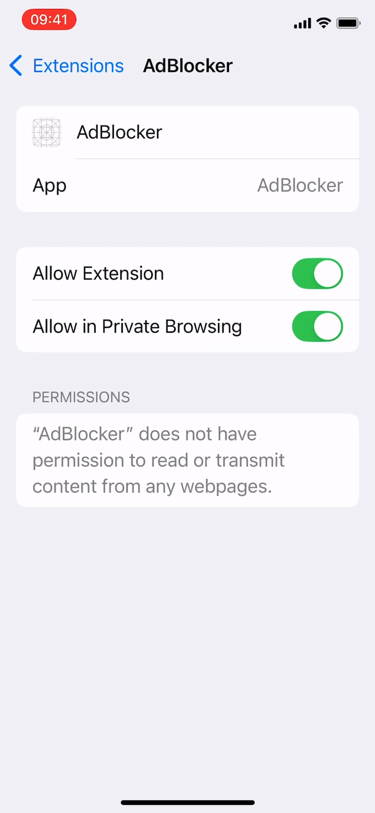

# Safari Ad Blocker - iOS Content Blocker POC

A native iOS Safari Content Blocker app built with **Swift 6**, **SwiftUI**, and **iOS 17+**, demonstrating modern Apple development patterns and the Safari Content Blocker API.

## Demo & Screenshots

| Safari Extension Enabled |
|:------------------------:|
|  |

https://github.com/user-attachments/assets/demo.mp4

## What This Demonstrates

- **Safari Content Blocker API**: Native ad/tracker blocking using Apple's `com.apple.Safari.content-blocker` extension point
- **Protocol-Oriented Architecture**: Swappable filter sources via `FilterSourceProviding` protocol
- **App Groups**: Shared container for app-to-extension data flow
- **iOS 17 `@Observable`**: Modern Observation framework (replacing `ObservableObject`)
- **Swift 6 Concurrency**: `Sendable` conformance, `@MainActor` isolation, structured concurrency
- **Comprehensive Test Suite**: Unit + integration tests with 60%+ coverage target

## Architecture

```
┌─────────────────────────────────────────────────┐
│                   AdBlocker App                  │
│  ┌──────────┐  ┌─────────────┐  ┌────────────┐ │
│  │ Settings  │  │ FilterEngine│  │   Views    │ │
│  │  Store    │──│             │  │ (SwiftUI)  │ │
│  └──────────┘  └──────┬──────┘  └────────────┘ │
│                       │                          │
│          ┌────────────┴────────────┐             │
│          │  FilterSourceProviding  │  (Protocol) │
│          └────────────┬────────────┘             │
│                       │                          │
│          ┌────────────┴────────────┐             │
│          │  BundledFilterSource    │  (Bundled)  │
│          │  RemoteFilterSource     │  (Planned)  │
│          │  SafariConverterLib...  │  (Planned)  │
│          └─────────────────────────┘             │
│                       │                          │
│              Writes assembled JSON               │
│                       │                          │
│          ┌────────────▼────────────┐             │
│          │    App Group Container   │            │
│          │  (assembledRules.json)   │            │
│          └────────────┬────────────┘             │
└───────────────────────┼──────────────────────────┘
                        │
┌───────────────────────┼──────────────────────────┐
│          Safari Content Blocker Extension         │
│          ┌────────────▼────────────┐             │
│          │ ContentBlockerRequest   │             │
│          │      Handler            │             │
│          └─────────────────────────┘             │
└──────────────────────────────────────────────────┘
```

## Protocol Abstraction

The core architecture centers on `FilterSourceProviding`:

```swift
protocol FilterSourceProviding: Sendable {
    func rules(for category: FilterCategory) async throws -> [FilterRule]
    func allCategories() -> [FilterCategory]
}
```

This POC ships with `BundledFilterSource` (loads rules from bundled JSON). The protocol enables swapping in:
- **RemoteFilterSource** - fetch rules from a server
- **SafariConverterLibSource** - convert EasyList/AdGuard filter lists on-device
- **CustomFilterSource** - user-defined custom rules

## Screens

1. **Onboarding** (3-page flow): Welcome, How It Works, Activate in Safari
2. **Home**: Protection status, quick stats, category toggles
3. **Settings**: Category toggles, whitelist management, Safari activation guide
4. **Whitelist**: Add/remove domains that bypass blocking
5. **Statistics**: Estimated blocked requests, active rule count

## Key Patterns

| Pattern | Implementation |
|---------|---------------|
| `@Observable` | SettingsStore, FilterEngine, StatsService |
| App Groups | Shared UserDefaults + file container between app and extension |
| Protocol Abstraction | `FilterSourceProviding` with bundled implementation |
| Safari Content Blocker JSON | Trigger/action rules with `url-filter` regex patterns |
| `SFContentBlockerManager` | Async reload after settings changes |
| `Sendable` | All models and protocols are `Sendable`-safe for Swift 6 |

## Filter Categories

| Category | Rules | Description |
|----------|-------|-------------|
| Ads | 25 | Ad networks (DoubleClick, Google Ads, Taboola, etc.) |
| Trackers | 15 | Analytics (Google Analytics, Facebook Pixel, Hotjar, etc.) |
| Social | 10 | Social widgets (Twitter embeds, Facebook plugins, etc.) |
| Annoyances | 10 | Cookie banners, newsletter popups, consent managers |

## Filter Rules & Sources

All filter rules follow Apple's [Safari Content Blocker JSON format](https://developer.apple.com/documentation/safariservices/creating-a-content-blocker). Each rule has a **trigger** (what to match) and an **action** (what to do).

### Rule Format

```json
{
  "trigger": {
    "url-filter": "doubleclick\\.net",
    "resource-type": ["script", "image"],
    "load-type": ["third-party"]
  },
  "action": { "type": "block" }
}
```

**Trigger fields:**
| Field | Description | Example |
|-------|-------------|---------|
| `url-filter` | Regex pattern matched against the URL | `"doubleclick\\.net"` |
| `resource-type` | Resource types to match | `["script", "image", "style-sheet", "document", "font", "raw", "svg-document", "media", "popup"]` |
| `load-type` | First-party or third-party | `["third-party"]` |
| `if-domain` | Only match on these domains (must start with `*`) | `["*ads.google.com"]` |
| `unless-domain` | Exclude these domains | `["*safe.example.com"]` |

**Action types:**
| Action | Description |
|--------|-------------|
| `block` | Block the network request entirely |
| `css-display-none` | Hide matching HTML elements via CSS selector |
| `ignore-previous-rules` | Whitelist - skip all previous rules for this URL |

### Bundled Rules

Rules are stored in `AdBlocker/Resources/Filters/` as JSON files:

#### Ads (`ads_rules.json` - 25 rules)

Blocks requests to major ad networks and ad-serving domains.

| # | Domain / Pattern | Action |
|---|-----------------|--------|
| 1 | `doubleclick.net` | block |
| 2 | `googlesyndication.com` | block |
| 3 | `googleadservices.com` | block |
| 4 | `adservice.google.*` | block |
| 5 | `pagead2.googlesyndication.com` | block |
| 6 | `ads.yahoo.com` | block |
| 7 | `advertising.com` | block |
| 8 | `ad.doubleclick.net` | block |
| 9 | `adnxs.com` (AppNexus) | block |
| 10 | `adsrvr.org` (The Trade Desk) | block |
| 11 | `amazon-adsystem.com` | block |
| 12 | `moatads.com` | block |
| 13 | `rubiconproject.com` | block |
| 14 | `pubmatic.com` | block |
| 15 | `openx.net` | block |
| 16 | `taboola.com` | block |
| 17 | `outbrain.com` | block |
| 18 | `criteo.com` | block |
| 19 | `bidswitch.net` | block |
| 20 | `casalemedia.com` | block |
| 21 | `smartadserver.com` | block |
| 22 | `adform.net` | block |
| 23 | `media.net` | block |
| 24 | Scripts from `ads.google.com` | block |
| 25 | Third-party `/ads/` path (images, scripts) | block |

#### Trackers (`trackers_rules.json` - 15 rules)

Blocks analytics, tracking pixels, and user behavior monitoring.

| # | Domain / Pattern | Action |
|---|-----------------|--------|
| 1 | `google-analytics.com` | block |
| 2 | `googletagmanager.com` | block |
| 3 | `facebook.com/tr` (Pixel) | block |
| 4 | `connect.facebook.net/.../fbevents` | block |
| 5 | `hotjar.com` | block |
| 6 | `mixpanel.com` | block |
| 7 | `segment.com/analytics` | block |
| 8 | `amplitude.com` | block |
| 9 | `fullstory.com` | block |
| 10 | `clarity.ms` (Microsoft Clarity) | block |
| 11 | `newrelic.com/nr-` | block |
| 12 | `sentry.io/api` | block |
| 13 | `bat.bing.com` (Bing UET) | block |
| 14 | `snap.licdn.com` (LinkedIn Insight) | block |
| 15 | Scripts from `analytics.google.com` | block |

#### Social (`social_rules.json` - 10 rules)

Blocks social media embeds, share buttons, and widgets.

| # | Domain / Pattern | Action |
|---|-----------------|--------|
| 1 | `platform.twitter.com/widgets` | block |
| 2 | `connect.facebook.net/.../sdk` | block |
| 3 | `facebook.com/plugins` | block |
| 4 | `platform.linkedin.com/in.js` | block |
| 5 | `apis.google.com/js/plusone` | block |
| 6 | `pinterest.com/js/pinit` | block |
| 7 | `addthis.com` | block |
| 8 | `sharethis.com` | block |
| 9 | `disqus.com` (raw resources) | block |
| 10 | `addtoany.com` (scripts) | block |

#### Annoyances (`annoyances_rules.json` - 10 rules)

Hides cookie banners and newsletter popups via CSS, and blocks consent manager scripts.

| # | Target | Action |
|---|--------|--------|
| 1 | `.cookie-banner`, `.cookie-consent`, `.cookie-notice` | css-display-none |
| 2 | `.newsletter-popup`, `.newsletter-modal`, `.email-signup-popup` | css-display-none |
| 3 | `.push-notification-prompt`, `.notification-permission` | css-display-none |
| 4 | `#onetrust-banner-sdk`, `.onetrust-pc-dark-filter` | css-display-none |
| 5 | `.cc-window`, `.cc-banner`, `#cookieconsent` | css-display-none |
| 6 | `cookiebot.com` | block |
| 7 | `onetrust.com` | block |
| 8 | `trustarc.com` | block |
| 9 | `cookielaw.org` | block |
| 10 | `consensu.org` | block |

### Whitelist (ignore-previous-rules)

When a user whitelists a domain, the `FilterEngine` appends an `ignore-previous-rules` entry at the end of the assembled rules:

```json
{
  "trigger": {
    "url-filter": ".*",
    "if-domain": ["*example.com"]
  },
  "action": { "type": "ignore-previous-rules" }
}
```

This tells Safari to skip all previous blocking rules for that domain, effectively disabling ad blocking on whitelisted sites.

## Build Instructions

### Prerequisites
- Xcode 15+
- [XcodeGen](https://github.com/yonaskolb/XcodeGen) (`brew install xcodegen`)
- iOS 17+ Simulator or device

### Generate & Build

```bash
cd poc_next/safari-ad-blocker
xcodegen generate
open AdBlocker.xcodeproj
```

Build and run the `AdBlocker` scheme in Xcode.

### Run Tests

```bash
xcodebuild test \
  -project AdBlocker.xcodeproj \
  -scheme AdBlocker \
  -destination 'platform=iOS Simulator,name=iPhone 16'
```

## Content Blocker Reload Flow

```
Settings Change -> FilterEngine.assembleAndReload()
  -> Fetch rules from FilterSourceProviding (per enabled category)
  -> Append ignore-previous-rules for whitelisted domains
  -> Write assembled JSON to App Group container
  -> SFContentBlockerManager.reloadContentBlocker()
  -> Safari picks up new rules
```

## Future Enhancements

- **SafariConverterLib Integration**: Convert EasyList/AdGuard filter lists to Safari Content Blocker JSON
- **Remote Filter Updates**: Fetch updated rules from a server without app updates
- **Sentry Integration**: Crash reporting and error monitoring
- **CI/CD Pipeline**: GitHub Actions for build, test, and TestFlight distribution
- **Localization**: String Catalog structure ready for DE and other languages
- **Custom Rules**: User-defined blocking rules with regex support
- **iCloud Sync**: Sync whitelist and settings across devices
